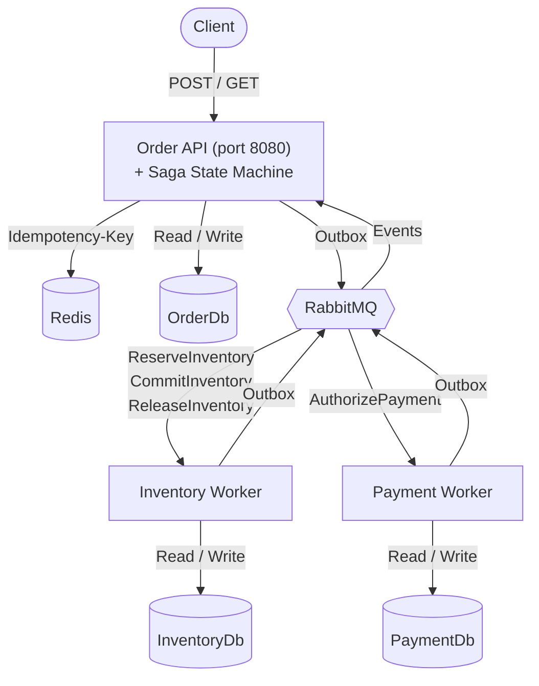

# OrderFlow.NET

A distributed order-processing system built on .NET 9 / C# 13 that demonstrates realistic distributed-systems patterns using three independent services communicating through RabbitMQ.

The system implements a complete order workflow — create order, reserve inventory, authorize payment, commit inventory, confirm order — with compensation logic that releases reserved inventory when payment fails. Each service runs as an independent process and owns its own SQL Server database. MassTransit's EF Core transactional outbox helps prevent dual-write issues across all services.

This is a portfolio/learning project. It is intentionally small but covers real distributed-systems concerns: asynchronous messaging, transactional outbox, inbox/consumer idempotency, saga orchestration, optimistic concurrency, eventual consistency, and HTTP-level idempotency with Redis.

## Architecture



Three services, three databases, one message broker. The Order API handles HTTP requests and hosts the saga state machine within the same process. The Inventory Worker and Payment Worker consume commands and publish events back through RabbitMQ. All cross-service communication is asynchronous.

## Distributed Order Workflow

### Happy Path

```
POST /api/orders
    ↓
Order created (status: Submitted)
    ↓ OrderCreated event
Saga → sends ReserveInventory command
    ↓
Inventory Worker reserves stock
    ↓ InventoryReserved event
Saga → updates order to InventoryReserved
Saga → sends AuthorizePayment command
    ↓
Payment Worker authorizes payment
    ↓ PaymentAuthorized event
Saga → updates order to PaymentAuthorized
Saga → sends CommitInventory command
    ↓
Inventory Worker commits reservation
    ↓ InventoryCommitted event
Saga → updates order to Confirmed
```

### Insufficient Stock

```
ReserveInventory
    ↓
AvailableQuantity < requested
    ↓ InventoryRejected event
Saga → updates order to Rejected
```

### Payment Failure (Compensation)

```
PaymentRejected event
    ↓
Saga → sends ReleaseInventory command
    ↓
Inventory Worker releases reserved stock
    ↓ InventoryReleased event
Saga → updates order to Rejected
```

The workflow is eventually consistent. There is no distributed ACID transaction across services — compensation is used instead.

## Services

### Order Service (`OrderFlow.Order.Api`)

REST API and workflow orchestration. Creates orders, queries order state, and hosts the MassTransit saga state machine that coordinates the distributed workflow. Uses Redis for HTTP-level idempotency on `POST /api/orders`. The order aggregate enforces status transitions: `Submitted → InventoryReserved → PaymentAuthorized → Confirmed` or `→ Rejected` at valid points.

### Inventory Service (`OrderFlow.Inventory.Worker`)

Background worker that consumes `ReserveInventory`, `CommitInventory`, and `ReleaseInventory` commands. Owns the `Product` aggregate with `AvailableQuantity` and `ReservedQuantity` fields. Uses SQL Server optimistic concurrency (`RowVersion`) to prevent overselling under concurrent reservations. Stock quantities can never go negative.

### Payment Service (`OrderFlow.Payment.Worker`)

Background worker that consumes `AuthorizePayment` commands. Payment authorization is simulated internally — no external payment gateway. The handler is idempotent: duplicate `AuthorizePayment` commands for the same `OrderId` reuse the existing `PaymentRecord` rather than creating duplicates.

### Contracts (`OrderFlow.Contracts`)

Shared message contracts only. This is the sole project referenced across service boundaries.

**Commands:** `ReserveInventory`, `ReleaseInventory`, `CommitInventory`, `AuthorizePayment`

**Events:** `OrderCreated`, `InventoryReserved`, `InventoryRejected`, `InventoryCommitted`, `InventoryReleased`, `PaymentAuthorized`, `PaymentRejected`, `OrderConfirmed`, `OrderRejected`

## Key Technical Concepts

**Transactional Outbox** — Each service uses MassTransit's EF Core transactional outbox. Business entity changes and outbox records commit in the same SQL transaction, preventing the dual-write problem between the database and RabbitMQ.

**Inbox / Consumer Idempotency** — All three services configure MassTransit's inbox mechanism. This helps prevent duplicate processing when the same message is delivered more than once, provided the consumer logic supports idempotent behavior. The inbox tracks processed message IDs at the infrastructure level.

**Saga State Machine** — The `OrderSaga` is a MassTransit `MassTransitStateMachine<OrderSagaState>` hosted inside the Order API process. Its states are: `PendingInventory`, `PendingPayment`, `PendingCommit`, `Confirmed`, `Compensating`, `Rejected`. The saga coordinates step sequencing and compensation but does not contain domain business rules.

**CQRS / MediatR** — The Order service separates commands (`CreateOrderCommand`) and queries (`GetOrderQuery`) using MediatR for in-process dispatching. The Payment service also uses MediatR for its `AuthorizePaymentCommand`. MediatR is never used for cross-service communication.

**Redis HTTP Idempotency** — The `POST /api/orders` endpoint requires an `Idempotency-Key` header. Redis stores the idempotency state with TTL. Duplicate requests with the same key and payload return the cached response. Different payloads on the same key return `409 Conflict`. If Redis is unavailable, the endpoint returns `503 Service Unavailable`.

**Optimistic Concurrency** — The `Product` entity uses SQL Server `RowVersion` mapped via EF Core. Concurrent reservation conflicts are detected through SQL Server optimistic concurrency. No distributed locks are used.

**Database-per-Service** — `OrderDb`, `InventoryDb`, `PaymentDb` are separate SQL Server databases. No service directly queries another service's database.

## Technology Stack

| Category | Technology | Version |
|---|---|---|
| Runtime | .NET | 9.0 |
| Language | C# | 13 |
| Messaging | MassTransit | 8.3.6 |
| Message Broker | RabbitMQ | 3.13 |
| ORM | Entity Framework Core | 9.0.x |
| Database | SQL Server | 2022 |
| Cache | Redis | 7 |
| In-Process CQRS | MediatR | 12.4.1 |
| HTTP Idempotency | StackExchange.Redis | 3.2.1 |
| API Documentation | Swashbuckle (Swagger) | 10.2.3 |
| Testing | xUnit | 2.9.2 |
| Integration Testing | Testcontainers | 4.14.0 |
| Containerization | Docker / Docker Compose | — |

## Project Structure

```
OrderFlow.NET/
├── src/
│   ├── OrderFlow.Contracts/              # Shared message contracts
│   │
│   ├── OrderFlow.Order.Domain/           # Order aggregate, OrderLine, OrderStatus
│   ├── OrderFlow.Order.Application/      # Commands, Queries, Saga, MediatR handlers
│   ├── OrderFlow.Order.Infrastructure/   # EF Core, MassTransit config, Redis, Repositories
│   ├── OrderFlow.Order.Api/              # ASP.NET Core API, Controllers, Idempotency Filter
│   │
│   ├── OrderFlow.Inventory.Domain/       # Product aggregate, stock invariants
│   ├── OrderFlow.Inventory.Application/  # Repository abstractions
│   ├── OrderFlow.Inventory.Infrastructure/ # EF Core, MassTransit config, Repositories
│   ├── OrderFlow.Inventory.Worker/       # Background worker, MassTransit consumers
│   │
│   ├── OrderFlow.Payment.Domain/         # PaymentRecord aggregate, status rules
│   ├── OrderFlow.Payment.Application/    # AuthorizePayment command/handler
│   ├── OrderFlow.Payment.Infrastructure/ # EF Core, MassTransit config, Repositories
│   └── OrderFlow.Payment.Worker/         # Background worker, MassTransit consumer
│
├── tests/
│   ├── OrderFlow.Order.Domain.Tests/           # Order status transitions, validation
│   ├── OrderFlow.Order.Infrastructure.Tests/   # Saga integration, DbContext, messaging
│   ├── OrderFlow.Inventory.Domain.Tests/       # Reserve, release, commit, invariants
│   ├── OrderFlow.Inventory.Infrastructure.Tests/ # Repository, consumer, integration
│   ├── OrderFlow.Payment.Domain.Tests/         # Payment authorization, rejection rules
│   ├── OrderFlow.Payment.Infrastructure.Tests/ # Repository, consumer, integration
│   └── OrderFlow.IntegrationTests/             # Full end-to-end workflow with Testcontainers
│
├── docs/
│   ├── ARCHITECTURE.md
│   └── DECISIONS.md
│
├── docker-compose.yml
├── Directory.Build.props
└── AGENTS.md
```

## Running Locally

### Prerequisites

- [.NET 9 SDK](https://dotnet.microsoft.com/download/dotnet/9.0)
- [Docker](https://docs.docker.com/get-docker/) (for Docker Compose and running infrastructure)

### Start Everything

```bash
docker compose up --build
```

This starts:

| Service | Container | Port |
|---|---|---|
| SQL Server 2022 | `orderflow-sqlserver` | `1433` |
| RabbitMQ | `orderflow-rabbitmq` | `5672` (AMQP), `15672` (Management UI) |
| Redis | `orderflow-redis` | `6379` |
| Order API | `orderflow-order-api` | `8080` |
| Inventory Worker | `orderflow-inventory-worker` | — |
| Payment Worker | `orderflow-payment-worker` | — |

EF Core migrations run automatically on startup in `Development` mode.

### Swagger

Once running, Swagger UI is available at:

```
http://localhost:8080/swagger
```

### Stop

```bash
docker compose down
```

To also remove persisted SQL Server data:

```bash
docker compose down -v
```

## API Example

### Create Order

```http
POST http://localhost:8080/api/orders
Content-Type: application/json
Idempotency-Key: 550e8400-e29b-41d4-a716-446655440000

{
  "customerId": "3fa85f64-5717-4562-b3fc-2c963f66afa6",
  "lines": [
    {
      "productId": "7c9e6679-7425-40de-944b-e07fc1f90ae7",
      "quantity": 2,
      "unitPrice": 29.99
    }
  ]
}
```

**Response** (`201 Created`):

```json
{
  "orderId": "...",
  "status": 0,
  "total": 59.98
}
```

The `status` field corresponds to the `OrderStatus` enum: `0` = Submitted, `1` = InventoryReserved, `2` = PaymentAuthorized, `3` = Confirmed, `4` = Rejected.

### Get Order

```http
GET http://localhost:8080/api/orders/{orderId}
```

**Response** (`200 OK`):

```json
{
  "id": "...",
  "customerId": "...",
  "status": 3,
  "total": 59.98,
  "createdAt": "2026-09-16T00:00:00+00:00",
  "rejectionReason": null,
  "lines": [
    {
      "productId": "...",
      "quantity": 2,
      "unitPrice": 29.99
    }
  ]
}
```

## Verified Scenarios

The following scenarios have been verified against the running system:

- **Successful order flow** — Order reaches `Confirmed` status. Inventory `AvailableQuantity` is decremented and `ReservedQuantity` returns to zero after commit.
- **Insufficient inventory** — Order is `Rejected` with a reason indicating insufficient stock. Inventory quantities remain unchanged.
- **Payment failure with compensation** — When payment is rejected, the saga sends `ReleaseInventory`, reserved stock is returned, and the order reaches `Rejected`.
- **HTTP idempotency (same payload)** — Reusing the same `Idempotency-Key` with an identical request body returns the original `201 Created` response with the same order ID.
- **HTTP idempotency (different payload)** — Reusing the same `Idempotency-Key` with a different request body returns `409 Conflict`.
- **Message queue health** — After workflow completion, RabbitMQ queues show no stuck Ready or Unacked messages.

## Testing

The project has 7 test projects covering domain logic, infrastructure, and full end-to-end workflows.

**Verified test result: 70 passed, 0 errors, 0 warnings.**

### Unit Tests

- **OrderFlow.Order.Domain.Tests** — Order creation validation, status transition rules (valid and invalid), rejection reasons.
- **OrderFlow.Inventory.Domain.Tests** — Product reserve/release/commit operations, quantity invariants, edge cases (zero, negative, exceeding available/reserved stock).
- **OrderFlow.Payment.Domain.Tests** — Payment creation, authorization, rejection, and invalid transition rules.

### Infrastructure Tests

- **OrderFlow.Order.Infrastructure.Tests** — Saga state machine integration tests, `OrderDbContext` persistence, MassTransit messaging configuration.
- **OrderFlow.Inventory.Infrastructure.Tests** — Product repository tests, `ReserveInventoryConsumer` tests, inventory integration tests.
- **OrderFlow.Payment.Infrastructure.Tests** — Payment repository tests, `AuthorizePaymentConsumer` tests, payment integration tests.

### End-to-End Integration Tests

- **OrderFlow.IntegrationTests** — Full distributed workflow tests using Testcontainers (SQL Server, RabbitMQ, Redis). Tests spin up the Order API, Inventory Worker, and Payment Worker in-process against real infrastructure. Coverage includes:
  - Successful order creation through to `Confirmed` status with stock verification
  - Insufficient stock rejection with inventory unchanged
  - HTTP idempotency: missing key returns `400`, duplicate key/same payload returns cached response, duplicate key/different payload returns `409`, concurrent requests return one `201` and one `409`

### Running Tests

```bash
dotnet test
```

Integration tests require Docker to be running (Testcontainers starts SQL Server, RabbitMQ, and Redis containers automatically).

## Design Decisions & Intentional Scope

- **Database-per-service**: Each service owns its database. No cross-service database access. This forces communication through explicit message contracts and makes distributed concerns real.
- **No distributed transactions**: The system uses eventual consistency with compensation (releasing inventory on payment failure) instead of distributed ACID transactions.
- **Simulated payment**: Payment authorization is simulated internally. No external payment gateway is integrated. This is intentional for the current scope.
- **Redis is only for HTTP idempotency**: Redis is not used for distributed locks, inventory coordination, caching, or message deduplication. MassTransit's inbox handles consumer-level idempotency.
- **MassTransit outbox/inbox**: All services use the EF Core transactional outbox to atomically persist business changes and messages. The inbox helps prevent duplicate consumer side effects.
- **Saga orchestrates, services own rules**: The `OrderSaga` state machine coordinates the workflow sequence and compensation. Domain business rules (stock checks, payment validation, order transitions) remain in their respective service domain layers.
- **Optimistic concurrency for inventory**: SQL Server `RowVersion` is used instead of distributed locks. Concurrent reservation conflicts are detected through SQL Server optimistic concurrency.
- **Clean Architecture domains**: Domain projects contain no references to EF Core, MassTransit, ASP.NET Core, or Redis.

Full architectural rationale is documented in [`docs/ARCHITECTURE.md`](docs/ARCHITECTURE.md) and [`docs/DECISIONS.md`](docs/DECISIONS.md).
